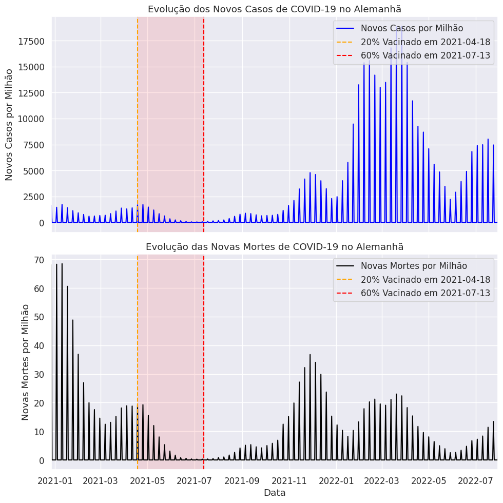
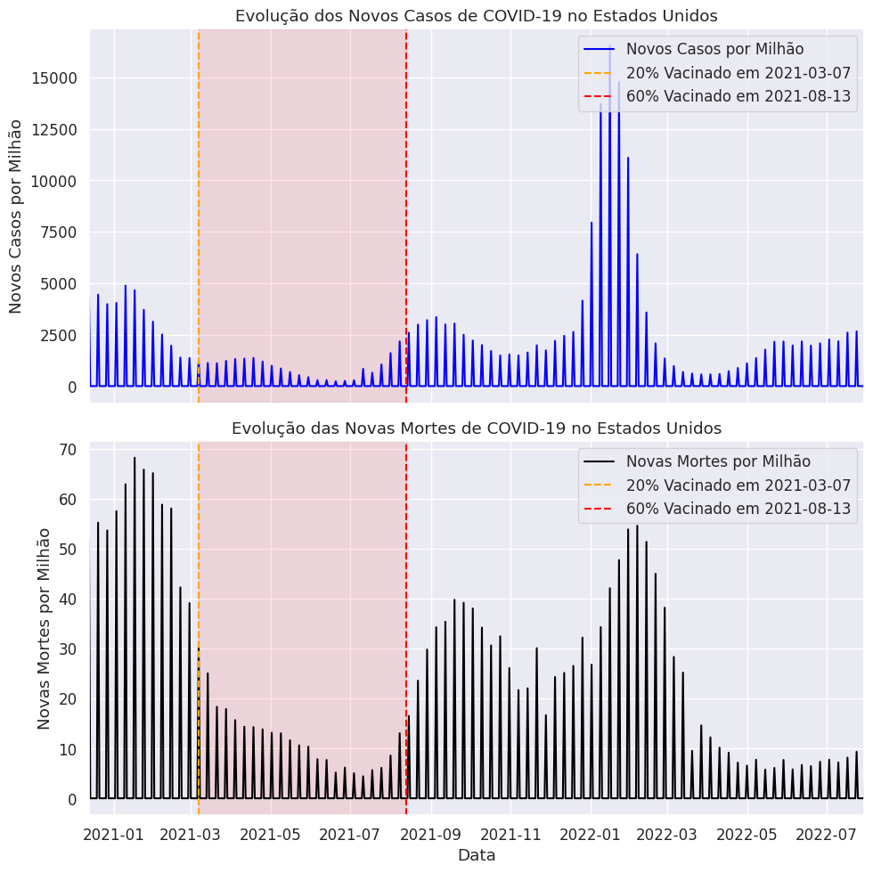

# COVID-19: Análise do Impacto da Vacinação em Casos e Mortalidade

Este projeto analisa como o avanço da vacinação impactou os **casos confirmados** e as **mortes** por COVID-19 em três países: **Brasil**, **Alemanha** e **Estados Unidos**. O foco está em observar:
- O efeito positivo da vacinação.
- O comportamento da pandemia após novas variantes.
- A diferença de mortalidade pós-vacinação.

---

## Objetivos

- Entender a relação entre **vacinação** e a **queda de casos/mortes**.
- Analisar o aumento pós-vacinação por fatores externos (ex: variantes).
- Comparar a efetividade da vacinação entre países.

---

## Resultados Visuais

### 1️ Casos e Vacinação – Brasil, Alemanha e EUA

- **Brasil** teve a **maior taxa de vacinação** (~90%).
- **Alemanha** teve o **maior número de casos** por milhão.
- **EUA** e **Brasil** tiveram **menos casos** em relação à Alemanha.

---

### 2️ Brasil 🇧🇷 – Casos e Mortes

- Após atingir **60% vacinados**, houve uma **queda forte nas mortes**.
- Apesar de um novo pico de casos, **as mortes permaneceram baixas**.

---

### 3️ Alemanha 🇩🇪 – Casos e Mortes

- Casos aumentaram fortemente em 2022, mesmo com vacinação.
- A **mortalidade ficou controlada**, mas **subiu levemente** com os picos.

---

### 4 Estados Unidos 🇺🇸 – Casos e Mortes

- **Casos voltaram a subir** com novas variantes.
- **Mortes não acompanharam** o mesmo ritmo dos casos.

---

## Análise Final

1. **Vacinação salvou vidas**: Em todos os países, quando a vacinação avançou entre **20% e 60%**, os casos e principalmente as mortes caíram fortemente.
2. **Aumento pós-quedas**: O aumento de casos em 2022 foi impulsionado por fatores como a **variante Ômicron**, o relaxamento de medidas sanitárias e a maior circulação de pessoas.
3. **Mortes controladas**: Mesmo com novos picos de infecção, as **mortes foram muito menores**, mostrando a **efetividade das vacinas** em reduzir a gravidade da doença.
4. **Brasil teve melhor desempenho relativo**: Com a **maior taxa de vacinação** entre os três, o Brasil teve **menos mortes** nos períodos de aumento, evidenciando a importância da alta cobertura vacinal.

---

## Fonte dos Dados

- [Our World in Data - COVID-19 Dataset](https://covid.ourworldindata.org/data/owid-covid-data.csv)

---

## Ferramentas

- Python | Pandas | Matplotlib | Seaborn

---

## Contato

Feito por Mateus Sitta
🔗 https://www.linkedin.com/in/mateussitta/
📧 mateussittaeng@gmail.com
